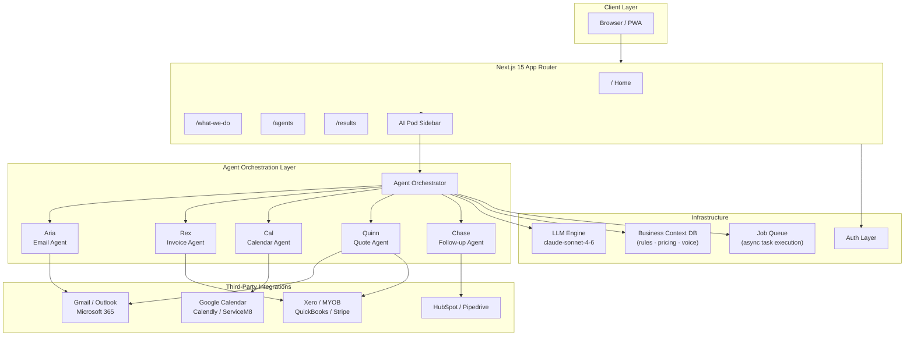
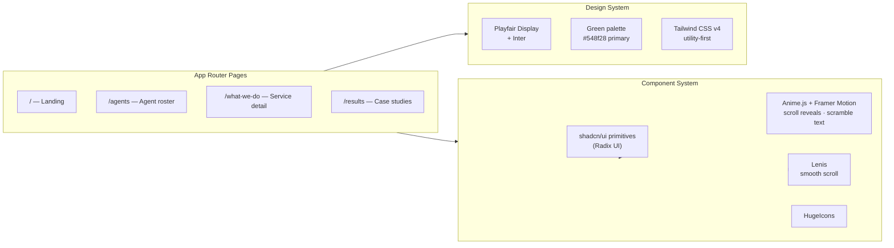
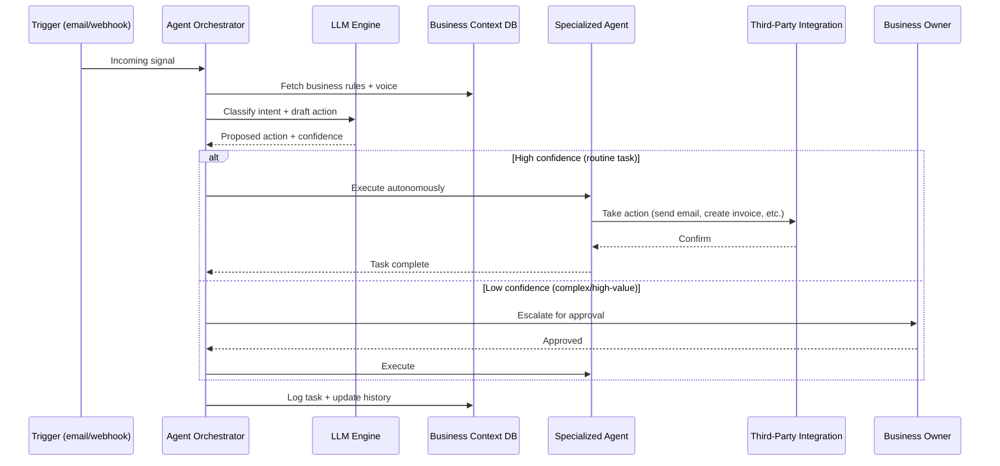

# Hourglass AI — Website Redesign

> **Give your business the one thing you can't buy more of.**
> AI agents that handle the admin so Australian SMBs can focus on the work that actually matters.

**Live:** [thehourglass.ai](https://thehourglass.ai) &nbsp;·&nbsp; **Status:** Early Access &nbsp;·&nbsp; **Stack:** Next.js 15 · React 19 · TypeScript · Tailwind CSS v4

---

## The Problem

The average Australian small business owner spends **18–22 hours every week** on admin — emails, invoices, quotes, follow-ups, scheduling. That's half a working week gone before a single billable minute is logged.

It's not laziness. It's not poor planning. It's the tax every growing business pays just to keep operating.

Hourglass AI exists to remove that tax entirely.

---

## What We Do

Hourglass AI deploys a team of specialized AI agents directly into your business operations. Each agent handles one category of admin — end-to-end, at human quality, 24/7 — and connects to the tools you already use.

No new software to learn. No workflows to rebuild. Just agents that slot in, get to work, and stop bothering you with tasks that don't need you.

```
You focus on the work.
The agents handle everything else.
```

---

## Who We Help

**You don't need to be technical to use Hourglass AI.** If you run a business and you're drowning in admin, we built this for you.

| Industry                      | What the agents handle                                               |
| ----------------------------- | -------------------------------------------------------------------- |
| Trades & Construction         | Quote follow-ups, job scheduling, invoice chasing, supplier comms    |
| Legal & Professional Services | Client onboarding emails, billing, matter follow-ups, calendar       |
| Accounting & Finance          | Client correspondence, tax season comms, appointment booking         |
| Retail & Hospitality          | Supplier invoices, delivery confirmations, customer enquiries        |
| Healthcare & Allied Health    | Appointment reminders, follow-up care comms, billing queries         |
| Creative & Agency             | Project quote → invoice pipeline, client check-ins, brief follow-ups |
| Real Estate                   | Inspection scheduling, tenant comms, lease admin correspondence      |
| Any Australian SMB            | If it can be described in plain English, an agent can handle it      |

**Technical or not — we can help you.** The setup is done for you. The agents work in plain English. The integrations connect in a few clicks. You describe what you need, and we deploy agents that do it.

---

## The Agents

### Aria — Email Agent

> _"Clears your inbox while you're on site."_

Aria reads every incoming email the moment it arrives. She categorises by urgency, drafts replies in your voice, handles routine enquiries automatically, and escalates anything that genuinely needs you.

**Handles:** New client enquiries · Status update requests · Supplier correspondence · Overdue payment chasers · Cold outreach filtering
**Connects:** Gmail · Outlook · Microsoft 365
**Stats:** 4,200+ tasks · 99.1% accuracy · <2 min avg

---

### Rex — Invoice Agent

> _"Sends the invoice. Chases the payment. Gets paid."_

Rex creates invoices from completed jobs, quotes, or purchase orders — then sends them. He runs a three-touch follow-up sequence for unpaid invoices (day 3, 7, 14), escalates at day 21, and reconciles every payment against your accounting software.

**Handles:** Auto-invoice on job completion · Quote-to-invoice conversion · Payment reminder sequences · Credit note requests · Xero/MYOB reconciliation
**Connects:** Xero · MYOB · QuickBooks · Stripe
**Stats:** 1,800+ tasks · 99.6% accuracy · <4 min avg

---

### Cal — Calendar Agent

> _"Books it, confirms it, reschedules it. Without you."_

Cal manages your schedule end to end. He reads incoming meeting requests, checks real availability, factors in travel time for site visits, and books the slot — then handles all the confirmation and reschedule threads.

**Handles:** Client meeting and site visit booking · Travel buffer calculation · Conflict detection · Reminder sequences (24hr, 2hr) · No-show follow-up
**Connects:** Google Calendar · Outlook · Calendly · ServiceM8
**Stats:** 3,100+ tasks · 98.8% accuracy · <3 min avg

---

### Quinn — Quote Agent

> _"Turns a scope into a professional proposal in minutes."_

Quinn takes incoming quote requests — by email, form, or message — and builds a professional proposal using your pricing templates, historical job data, and business rules. Sends automatically for straightforward jobs; holds for review on complex work.

**Handles:** Scope-to-quote from email or form · Historical pricing · Branded PDF output · Automatic 48-hr follow-up · Accepted quote → invoice trigger
**Connects:** Gmail · Outlook · ServiceM8 · Xero
**Stats:** 920+ tasks · 97.4% accuracy · <10 min avg

---

### Chase — Follow-up Agent

> _"The touchpoint you always meant to make."_

Chase runs every follow-up sequence your business needs but never gets to. Hot leads, cold prospects, post-job check-ins, overdue proposals — Chase tracks them all and reaches out at exactly the right moment, in your voice.

**Handles:** Lead follow-up sequences · Post-job satisfaction check-ins · Lapsed client reactivation · Proposal expiry nudges · Review request timing
**Connects:** Gmail · Outlook · HubSpot · Pipedrive

---

## Proven Results

| Business                                | Outcome                                                                                                       |
| --------------------------------------- | ------------------------------------------------------------------------------------------------------------- |
| Mitchell Plumbing (4 staff, Melbourne)  | 14 hrs/week saved · $28k in overdue invoices recovered in 60 days · quote turnaround 3 days → 6 min           |
| Tran & Co Accounting (8 staff, Sydney)  | 22 hrs/week returned to billable work · client onboarding 4 days → 6 hrs · zero missed follow-ups in 6 months |
| Sharma Legal (3 staff, Brisbane)        | 11 hrs/week saved · 41% faster client response time · 2× matters handled per month                            |
| Coastal Interiors (6 staff, Gold Coast) | 19 hrs/week freed for owner · 3× revenue growth in 12 months · 100% of supplier invoices auto-reconciled      |

### Aggregate

- **186,000+** admin hours saved across customers
- **$4.2M+** in overdue invoices recovered
- **99.2%** task accuracy rate
- **8 days** average payback period

---

## Visibility in AI-Powered Search (AEO · SEO · GEO)

The way customers find businesses is changing faster than most owners realise. Here's what's happening and how Hourglass AI is built for it.

### SEO — Search Engine Optimization

Traditional Google rankings still matter. Hourglass AI's marketing layer is built with structured data, semantic HTML, fast page loads, and content that directly answers the questions Australian SMBs type into search.

### AEO — Answer Engine Optimization

When someone asks ChatGPT, Perplexity, or Siri _"what's the best admin automation tool for Australian small business"_, the answer is pulled from structured, authoritative content — not raw rankings. Hourglass AI is built so that AI assistants can accurately describe what it does, who it's for, and why it works.

### GEO — Generative Engine Optimization

Large language models are increasingly used as discovery surfaces. GEO is the practice of making your business the cited source when an LLM generates an answer about your category. Hourglass AI builds client-facing content (case studies, agent descriptions, result data) in formats that LLMs can parse, cite, and recommend.

**The upshot:** Whether your next customer finds you through Google, asks an AI assistant, or gets a recommendation from a chatbot — Hourglass AI is built to be found.

---

## Architecture

### System Overview



### Frontend Architecture



### Data Flow: How an Agent Handles a Task



---

## Tech Stack

| Layer                | Technology                    |
| -------------------- | ----------------------------- |
| Framework            | Next.js 15 (App Router)       |
| UI Library           | React 19                      |
| Language             | TypeScript 6                  |
| Styling              | Tailwind CSS v4               |
| Component Primitives | Radix UI / shadcn/ui          |
| Animation            | Anime.js 4 + Framer Motion 12 |
| Scroll               | Lenis (Studio Freight)        |
| Icons                | HugeIcons                     |
| LLM Engine           | Claude (Anthropic)            |
| Deployment           | AWS Amplify                   |

---

## Project Structure

```
src/
├── app/
│   ├── page.tsx              # Landing page (hero, agents overview, stats, testimonials)
│   ├── agents/page.tsx       # Full agent roster with detail cards
│   ├── what-we-do/page.tsx   # Service detail and how it works
│   ├── results/page.tsx      # Case studies and aggregate outcomes
│   └── layout.tsx            # Root layout (fonts, providers, sidebar)
├── components/
│   ├── ui/                   # Reusable UI primitives
│   │   ├── cpu-architecture.tsx    # Animated CPU/agent diagram
│   │   ├── magnified-bento.tsx     # Bento grid with magnify effect
│   │   ├── logo-timeline.tsx       # Integration logo strip
│   │   ├── testimonial.tsx         # Bento testimonial layout
│   │   ├── agent-plan.tsx          # Agent pricing plan cards
│   │   └── cards-slider-shadcnui.tsx
│   ├── blocks/
│   │   └── sidebar.tsx             # AI Pod sidebar panel
│   ├── agent-cards/                # Agent roster cards
│   ├── scroll-story/               # Scroll-driven narrative section
│   ├── testimonials/               # Testimonial section
│   ├── trust-logos/                # Social proof logo strip
│   ├── cta/                        # Call-to-action section
│   ├── footer/                     # Site footer
│   ├── icons/                      # Icon components
│   └── logo.tsx                    # Hourglass wordmark
└── lib/
    ├── utils.ts                    # clsx/tailwind-merge helpers
    └── lenis-provider.tsx          # Smooth scroll context provider
```

---

## Founder Story

Hourglass AI was started by someone who watched great businesses fail — not from poor products, not from bad service, but from drowning in the operational noise that comes with growth.

The observation was always the same: the owner was the bottleneck. Not because they weren't capable, but because every hour they spent chasing an invoice or rescheduling a meeting was an hour they weren't spending on the thing that made their business worth running in the first place.

The insight behind Hourglass AI isn't new — it's actually ancient. An hourglass doesn't add more time. It just makes sure every grain gets to where it needs to go. That's what this platform does: it doesn't give you more hours. It returns the ones that were being wasted.

The choice to focus on Australian SMBs was deliberate. Australia has over 2.5 million small businesses. They're the backbone of the economy, they employ most of the workforce, and they run leaner than any enterprise could. But the admin tools built for them were either too simple to be useful or too complex to be worth the training time. There was nothing in the middle — until now.

Hourglass AI is built on one conviction: **every business, regardless of how technical its owner is, deserves access to the operational leverage that was previously only available to large teams with large budgets.**

The agents are named. They have personalities. That's intentional too — because the goal was never to build software. It was to build a team that shows up every day, never complains, and handles the tasks you never wanted to do in the first place.

---

## Getting Started (Dev)

```bash
# Clone
git clone https://github.com/Ansh0928/hour-glass-ai-_-redesign-.git
cd hour-glass-ai-_-redesign-

# Install
npm install

# Run
npm run dev
# → http://localhost:3000

# Type check
npm run typecheck

# Lint
npm run lint

# Build
npm run build
```

---

## Roadmap

- [x] Marketing site (this repo)
- [x] Agent detail pages
- [x] Case study / results pages
- [ ] Agent dashboard (live task feed)
- [ ] Onboarding flow (connect integrations, set business rules)
- [ ] AI Pod — in-browser agent chat interface
- [ ] Mobile app
- [ ] Webhook integrations (Zapier, Make, n8n)
- [ ] Enterprise multi-seat support

---

## Contributing

This is the public marketing site for Hourglass AI. The core agent platform is closed source.

For design feedback, feature requests, or partnership enquiries: [hello@thehourglass.ai](mailto:hello@thehourglass.ai)

---

_Built in Melbourne. For Australian businesses. By people who believe the admin should never be the reason a great business stops growing._
